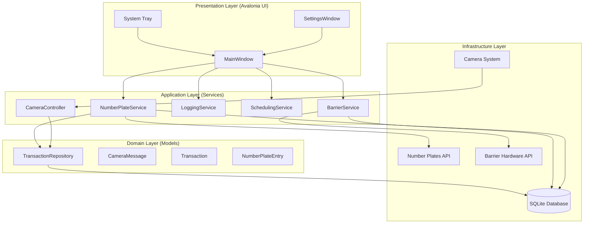
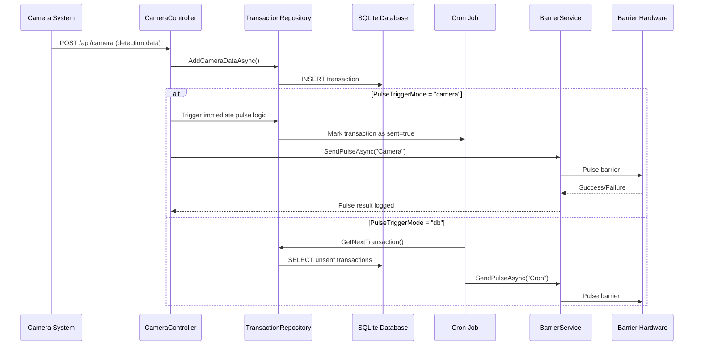

# Barrier Control System

## Overview

A comprehensive C# Avalonia-based desktop application for managing automated barrier controls with number plate validation, camera integration, scheduling, and multi-authentication number plate management.

## Core Features

- **Camera API Integration**: RESTful POST endpoint for camera detection data with configurable auto-pulse triggers
- **Multi-Authentication**: Individual basic auth credentials for each number plate whitelist
- **Flexible Pulse Control**: Configurable barrier pulsing via immediate camera triggers or scheduled batch processing
- **Advanced Scheduling**: Cron-based jobs for automated barrier operations and data synchronization
- **Intelligent Validation**: Date/time range validation with per-barrier fallback behaviors
- **Real-time Monitoring**: Comprehensive logging with visual indicators and system tray integration
- **Multi-Barrier Support**: Independent configuration and operation for multiple barrier points

## System Architecture

### High-Level Components



### Data Flow Pattern



## Detailed Configuration

### appsettings.json Full Structure

```json
{
  "Barriers": {
    "Count": 3,
    "Barriers": {
      "Barrier1": {
        "CronExpression": "*/5 * * * * ?",
        "ApiUrl": "http://192.168.1.2/status.xml?pl1=1",
        "LaneId": 1,
        "ApiDownBehavior": "UseHistoric",
        "IsEnabled": false
      },
      "Barrier2": {
        "CronExpression": "*/7 * * * * ?",
        "ApiUrl": "http://192.168.1.2/status.xml?pl2=1",
        "LaneId": 2,
        "ApiDownBehavior": "DontOpen",
        "IsEnabled": true
      },
      "Barrier3": {
        "CronExpression": "*/5 * * * * ?",
        "ApiUrl": "http://192.168.1.2/status.xml?pl2=1",
        "LaneId": 3,
        "ApiDownBehavior": "OpenAny",
        "IsEnabled": true
      }
    }
  },
  "NumberPlatesApiUrl": "http://localhost:5291/api/v1/{id}/activeplates",
  "NumberPlatesCronExpression": "0 0 * * * ?",
  "WhitelistCredentials": [
    {
      "Id": "WL001",
      "Username": "user1",
      "Password": "pass1"
    },
    {
      "Id": "WL002",
      "Username": "user2",
      "Password": "pass2"
    }
  ],
  "PulseTriggerMode": "db",
  "SendInitialPulse": false,
  "SkipInitialCronPulse": true,
  "PerformInitialApiStatusCheck": false,
  "StartOpenOnLaunch": false,
  "DatabaseInitMode": "keep",
  "DebugLogging": false,
  "AutostartNumberPlates": true,
  "LogFilePath": "",
  "BarrierIpAddress": "",
  "BarrierPort": 0,
  "BarrierTimeout": 5000,
  "ApiUsername": "admin",
  "ApiPassword": "secret",
  "DatabasePath": "sync.db"
}
```

### Configuration Properties Reference

| Property | Type | Default | Description |
| --- | --- | --- | --- |
| `Barriers.Count` | integer | 3 | Number of barriers configured (must match barriers object) |
| `Barriers.Barriers.{Name}.CronExpression` | string | varies | Quartz cron expression for barrier pulse schedule |
| `Barriers.Barriers.{Name}.ApiUrl` | string | URL | HTTP endpoint for physical barrier control |
| `Barriers.Barriers.{Name}.LaneId` | integer | 1-3 | Unique lane identifier for database mapping |
| `Barriers.Barriers.{Name}.ApiDownBehavior` | string | "UseHistoric" | Fallback mode: "UseHistoric", "DontOpen", "OpenAny" |
| `Barriers.Barriers.{Name}.IsEnabled` | boolean | false/true | Whether this barrier participates in cron scheduling |
| `NumberPlatesApiUrl` | string | URL template | API base URL with {id} placeholder for whitelist IDs |
| `NumberPlatesCronExpression` | string | "0 0 \* \* \* ?" | When to fetch number plate data from API |
| `WhitelistCredentials` | array | see example | Per-whitelist basic auth credentials with {Id, Username, Password} |
| `PulseTriggerMode` | string | "db" | "db" (cron pulls from DB) or "camera" (immediate pulse on camera data) |
| `SendInitialPulse` | boolean | false | Whether to pulse barriers sequentially on startup |
| `SkipInitialCronPulse` | boolean | true | Skip first cron execution on application start |
| `PerformInitialApiStatusCheck` | boolean | false | Check barrier API availability on startup |
| `StartOpenOnLaunch` | boolean | false | Show main window on application startup |
| `DatabaseInitMode` | string | "keep" | "keep" (preserve data) or "recreate" (drop existing DB) |
| `DebugLogging` | boolean | false | Verbose logging for troubleshooting |

#### ApiDownBehavior Options

- **UseHistoric**: Use previously cached number plate data (most secure)
- **DontOpen**: Block all vehicles when API fails (most restrictive)
- **OpenAny**: Allow all vehicles to pass without validation (fail-open)

## Camera Integration

### API Specification

**Endpoint**: `POST /api/camera`

**Authentication**: Basic Auth with app-level `ApiUsername`/`ApiPassword`

**Content-Type**: `application/json`

**Request Body**: `CameraMessage` JSON with single or multiple detections

### Single Detection Format

```json
{
  "Vrm": "ABC123",
  "Confidence": "85",
  "LogicalDirection": "1",
  "CameraSerial": "CAM001",
  "FirstSeenWallClock": "2025-10-13T22:00:00Z",
  "Images": {
    "image_1": "base64_img_data",
    "image_2": "base64_img_data"
  }
}
```

### Multiple Detection Format

```json
{
  "vrmMessages": [
    {
      "Vrm": "DEF456",
      "Confidence": "90",
      "LogicalDirection": "0",
      "CameraSerial": "CAM002",
      "FirstSeenWallClock": "2025-10-13T22:05:00Z"
    }
  ]
}
```

### Camera Data Fields

| Field | Type | Required | Description |
| --- | --- | --- | --- |
| `Vrm` | string | Yes | Vehicle registration mark (license plate) |
| `Confidence` | string | No | OCR confidence percentage (0-100) |
| `LogicalDirection` | string | No | "1"=In/Inbound, "0"=Out/Outbound |
| `CameraSerial` | string | No | Unique camera identifier |
| `FirstSeenWallClock` | string | No | ISO 8601 timestamp of detection |
| `Images` | object | No | Dictionary of base64 image data |

### Response Format

```json
{
  "saved": true,
  "count": 1
}
```

## Testing and Validation

### Camera Integration Tests

```bash
# Test single camera detection
./test-camera.ps1

# Check transaction was inserted
sqlite3 sync.db "SELECT * FROM transactions ORDER BY id DESC LIMIT 1;"

# Verify logging shows camera data receipt
# Look for "Camera data received: VRM [plate]" in app logs
```

### Pulse Trigger Testing

**For PulseTriggerMode = "db" (default):**

1. Send camera data: `./test-camera.ps1`
2. Transaction inserted unsent (`sent = 0`)
3. Wait for next cron cycle
4. Cron finds transaction, processes, marks `sent = 1`
5. Barrier pulses with "Cron pulse sent successfully"

**For PulseTriggerMode = "camera":**

1. Send camera data: `./test-camera.ps1`
2. Immediate barrier pulse with "Camera pulse sent successfully"
3. Transaction inserted and marked `sent = 1`

### Multi-Auth Whitelist Testing

```bash
# Enable app debug logging
# "DebugLogging": true

# Check each whitelist is fetched
# Expected: "Fetching whitelist for WL001 from http://localhost:5291/api/v1/WL001/activeplates"
# Expected: "Fetched 25 plates for WL001"
```

### Common Test Scenarios

- **Connection Failure**: Configure invalid API URL, verify retry logs and graceful failure
- **Auth Failure**: Incorrect whitelist credentials, verify per-ID failure handling
- **Empty Response**: API returns 200 with empty array, verify logging
- **Concurrent Requests**: Send multiple `./test-camera.ps1` calls rapidly to test DB locking

## Troubleshooting

### Common Issues

#### Cron Jobs Not Finding Camera Data

**Problem**: Camera data inserted but cron pulses don't trigger

**Check**:

```sql
-- Verify data insertion
SELECT created, ocr_plate, lane_id, sent FROM transactions ORDER BY id DESC LIMIT 5;
-- Should have recent rows with sent=0

-- Verify timezone consistency
SELECT datetime('now'), datetime('now', 'localtime');
-- Camera insert uses local time, should match cron timezone
```

**Fix**: Ensure `DateTime.Now` (local) vs `DateTime.UtcNow` mismatch resolved

#### Authentication Failures

**Problem**: Whitelist fetch fails with 401 errors

**Check**:

- `WhitelistCredentials` array has correct `Id`, `Username`, `Password`
- API expects basic auth format
- Credentials match per-whitelist server requirements

**Fix**: Verify credential objects in config match server expectations

#### API Connection Refused

**Problem**: "No connection could be made because the target machine actively refused it. (localhost:5291)"

**Fix**:

- Ensure target service is running
- Check firewall/proxy settings
- Verify URL format and port accessibility
- For whitelist APIs, URL shows full path: `http://localhost:5291/api/v1/{id}/activeplates`

#### Database Issues

**Problem**: PDO exceptions or "unable to open" errors

**Check**:

```sql
-- Test DB connectivity
sqlite3 sync.db "SELECT sqlite_version();"
-- Should return version string
```

**Fix**:

- Verify `sync.db` file exists and is writable
- Set `DatabaseInitMode` to "keep" to preserve existing data
- Check path permissions

### Logging Analysis

Enable debug logging in configuration:

```json
{ "DebugLogging": true }
```

Monitor logs for:

- Full API URLs on failures: `"Retry 1 for number plates fetch on http://localhost:5291/api/v1/WL001/activeplates"`
- Successful operations: `"Fetched 15 plates for WL001"`
- Database operations: `"INSERT INTO transactions..."`

### Performance Monitoring

Check system performance with:

```sql
-- Transaction queue length
SELECT COUNT(*) as pending FROM transactions WHERE sent = 0;

-- Average processing time (if logging timestamps available)
SELECT created, sent_datetime FROM transactions WHERE sent = 1 ORDER BY created DESC LIMIT 10;
```

## Security Considerations

### API Security

- Use HTTPS for all external API endpoints in production
- Implement proper certificate validation
- Store API credentials securely (consider environment variables)
- Rate limiting for camera POST endpoint
- Validate camera input data to prevent injection

### Database Security

- SQLite file should be secured (file permissions)
- Avoid storing sensitive data in clear text
- Regular backups of transaction history
- Consider encryption for sensitive fields

### Authentication

- Basic auth for camera API (consider JWT or OAuth)
- Per-whitelist credentials prevent single-point-failure
- Access logging for audit trails
- Credential rotation policies

## Production Deployment

### Environment Variables (Recommended)

```bash
# Database
BARRIER_DatabasePath=/var/barrier/sync.db

# API Credentials
BARRIER_ApiUsername=prod_user
BARRIER_ApiPassword=$PROD_PASS

# Whitelist APIs
BARRIER_NumberPlatesApiUrl=https://prod-api.example.com/v1/{id}/plates

# System Settings
BARRIER_DebugLogging=false
BARRIER_StartOpenOnLaunch=false
```

### Service Configuration

- Run as system service (Windows Service/Linux systemd)
- Configurable restart policies
- Log file rotation
- Monitoring integration (health checks)

### Scaling Considerations

- Multiple barrier instances support different lane configurations
- Database connection pooling for high throughput
- API rate limiting to prevent abusing whitelist endpoints
- Separate camera service for high-volume processing

## Development Workflow

### Cline Checkpoints

The project uses Cline checkpoints to save/restore development state:

- **Terminal Sessions**: Running `dotnet run` commands with open logs
- **File History**: Recently edited configuration files
- **Testing State**: Current test scripts and output

Save checkpoints at major milestones: "Camera Integration Complete", "Multi-Auth Configured", etc.

### Build Process

```bash
# Development
dotnet build

# Production optimized
dotnet publish -c Release -r win-x64 --self-contained
```

### Testing Pipeline

1. Unit Tests (when added): `dotnet test`
2. Integration Tests: `./test-camera.ps1`
3. Manual UI testing: Log inspection, button functions, tray icon
4. Configuration change testing: Settings window updates
5. System restart testing: Clean shutdown and restart behavior

This comprehensive guide ensures smooth development, deployment, and operation of the barrier control system.
